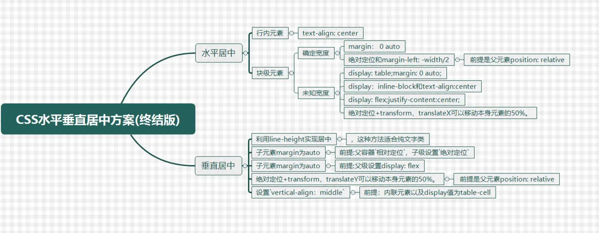

# CSS 面试总结

## CSS 盒模型

box-sizing 有三个值：border-box，padding-box，content-box

+ `content-box`（标准盒模型）：width 为 content，盒子整个宽度为 width、padding、border 的和。
+ `border-box`（IE 盒模型）: width 为 content、padding border 的总和，因此盒子的宽度就为 width。

Js 如何设置获取盒模型对应的宽高

+ `DOM.style.width/height` (只适用于内联样式)
+ `DOM.currentStyle.width/height`(IE 支持)
+ `window.getComputedStyle(DOM).widht/height`(chrome、firefox)
+ `DOM.getBoundingClientRect().widht/height`

根据盒模型解释边距重叠

## BFC 及其应用

BFC(块级格式化上下文) 会生成一个独立的渲染区域，让处于 BFC 内部的元素与外部的元素相互隔离，使内外元素的定位不会相互影响

+ BFC 作用：

  + 可以阻止元素被浮动元素覆盖
  + 清除内部浮动
  + 自适应两栏布局
  + 防止垂直 `margin` 重叠

+ 触发 BFC：

  + 根元素，即`html`
  + `float`的值不为 `none`
  + 绝对定位或固定定位，`position: absolute/fixed`
  + `overflow` 的值不为 `visible`
  + `display: table/inline-block`中的任何一个

+ 规则：

  + 属于同一个 BFC 的两个相邻 Box 垂直排列
  + 属于同一个 BFC 的两个相邻 Box 的 `margin` 会发生重叠
  + BFC 中子元素的 margin box 的左边， 与包含块 (BFC) border box 的左边相接触 (子元素 absolute 除外)
  + BFC 的区域不会与 `float` 的元素区域重叠
  + 计算 BFC 的高度时，浮动子元素也参与计算
  + 文字层不会被浮动层覆盖，环绕于周围

## position 四种定位的区别

+ `static`（默认）：按照正常文档流进行排列
+ `relative`（相对定位）：相对于自身原有位置进行偏移，仍处于标准文档流中
+ `absolute`(绝对定位)：相对于最近的已定位（非 `static`）的祖先元素进行偏移，脱离标准文档流
+ `fixed`(固定定位)：相对于浏览器视窗定位，不随页面滚动，脱离标准文档流

## 水平垂直居中

+ 盒子宽高已知：绝对定位加负边距

```css
.parent {
  position: relative;
}
.son {
  position: absolute;
  width: 100px;
  height: 100px;
  left: 50%;
  top: 50%;
  margin: -50px 0 0 -50px; // 宽高的一半
}
```

+ 盒子宽高不定：绝对定位加 `margin: auto;` 或者使用 `transform`

```css
/* margin: auto; */
.parent {
  position: relative;
}
.son {
  position: absolute;
  margin: auto;
  top: 0;
  bottom: 0;
  left: 0;
  right: 0;
}
/* transform */
.son {
  position: absolute;
  width: 100px;
  height: 100px;
  left: 50%;
  top: 50%;
  transform: (-50%, -50%);
}
```

+ flex：`justify-content: center;align-items: center;`

```css
.parent {
  display: flex; // IE9以上
  justify-content: center;
  align-items: center;
}
```

