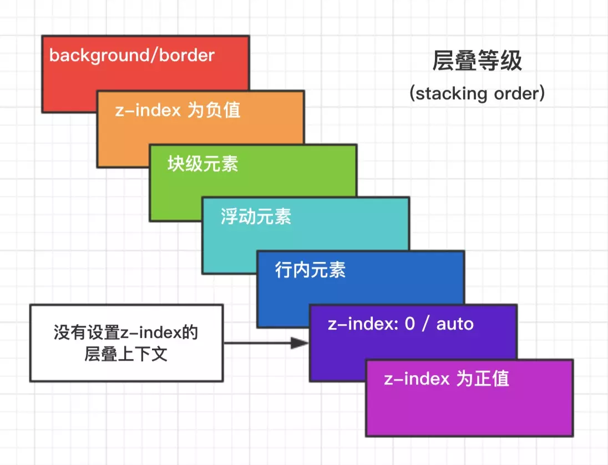

# HTML 和 CSS 面试题

## HTML5 新特性

- 语义化的标签：

  - `header`：文档的头部
  - `footer`：定义 section 或 document 的页脚
  - `section`：档中的节
  - `article`：页面独立的内容区域
  - `aside`：页面的侧边栏内容
  - `nav`：页面导航部分
  - `details`：文档或文档某个部分的细节
  - `summary`：标签包含 details 元素的标题
  - `dialog`：定义对话框，比如提示框

- `canvas`元素、`SVG`元素

- 多媒体元素：`video` 视频、`audio` 音频、`source` 资源、`embed` 嵌入的内容、`track`外部文本轨道

- 新增 `input` 输入类型：`color`，`date`、`time`、`email`、`url`、`search`、`tel`、`range`、`number`

- 拖放 API，要拖放的元素设置 `draggable=true`

  - `ondragstart`：当拖拽元素开始被拖拽的时候触发的事件，作用在被拖曳元素上
  - `ondragenter`：当拖曳元素进入目标元素的时候触发的事件，作用在目标元素上
  - `ondragover`：拖拽元素在目标元素上移动的时候触发的事件，作用在目标元素上
  - `ondrop`：被拖拽的元素在目标元素上同时鼠标放开触发的事件，作用在目标元素上
  - `ondragend`：当拖拽完成后触发的事件，作用在被拖曳元素上

- Web 存储：`localStorage`、`sessionStorage`

- 程序缓存：`Application Cache`，在文档的 `html` 标签中设置 `manifest` 属性，指定文件扩展名是：`.appcache`的 `manifest` 文件

- `Webworker`：是运行在后台的脚本

- `websocket`：在单个 TCP 连接上进行全双工通讯的协议

- `Geolocation`：地理定位 API

## CSS3 有哪些新特性

- 新的元素选择器
- RGBA 和透明度
- 边框： `border-radius，border-image，box-shadow`
- 背景：`background-clip、background-origin、background-size`
- 文字特效：`text-shadow`
- 线性渐变：`gradient`
- 形变、转换：`transform`，将元素旋转，缩放，移动，倾斜等，
- 过渡：`transition`，一种状态到另一种状态的过渡动画，需要触发一个事件才能改变
- 动画：`animation`，通过关键帧控制动画的每一步
- 字体：`@Font-face`
- 媒体查询：`@media`

## CSS 选择器优先级

- `!important` > 行内样式 > `#id` > `.class` > `tag` > `*`> 继承 > 默认
- 选择器 `从右往左` 解析

## `link` 与 `@import` 的区别

- `link`功能较多，可以定义 RSS，定义 rel ，动态引入 js ，`@import`不行，只能用于加载 css
- 当解析到 `link` 时，页面会同步加载所引的 css，而`@import`所引用的 css 会等到页面加载完才被加载

## 盒模型

box-sizing 有三个值：border-box，padding-box，content-box

- `content-box`（标准盒模型）：width 为 content，盒子整个宽度为 width、padding、border 的和。
- `border-box`（IE 盒模型）: width 为 content、padding border 的总和，因此盒子的宽度就为 width。

## position 四种定位的区别

- `static`（默认）：按照正常文档流进行排列
- `relative`（相对定位）：相对于自身原有位置进行偏移，仍处于标准文档流中
- `absolute`(绝对定位)：相对于最近的已定位（非 `static`）的祖先元素进行偏移，脱离标准文档流
- `fixed`(固定定位)：相对于浏览器视窗定位，不随页面滚动，脱离标准文档流

## BFC 块级格式化上下文

BFC 会生成一个独立的渲染区域，让处于 BFC 内部的元素与外部的元素相互隔离，使内外元素的定位不会相互影响

- BFC 作用：

  - 可以阻止元素被浮动元素覆盖
  - 清除内部浮动
  - 自适应两栏布局
  - 防止垂直 `margin` 重叠

- 触发 BFC：

  - 根元素，即`html`
  - `float`的值不为 `none`
  - 绝对定位或固定定位，`position: absolute/fixed`
  - `overflow` 的值不为 `visible`
  - `display: table/inline-block`中的任何一个

- 规则：

  - 属于同一个 BFC 的两个相邻 Box 垂直排列
  - 属于同一个 BFC 的两个相邻 Box 的 `margin` 会发生重叠
  - BFC 中子元素的 margin box 的左边， 与包含块 (BFC) border box 的左边相接触 (子元素 absolute 除外)
  - BFC 的区域不会与 `float` 的元素区域重叠
  - 计算 BFC 的高度时，浮动子元素也参与计算
  - 文字层不会被浮动层覆盖，环绕于周围

## 层叠上下文

元素提升为一个比较特殊的图层，在三维空间中 (z 轴) 高出普通元素。`z-index`的优先级最高



## 水平垂直居中

- 盒子宽高已知：绝对定位加负边距

```css
.parent {
  position: relative;
}
.son {
  position: absolute;
  width: 100px;
  height: 100px;
  left: 50%;
  top: 50%;
  margin: -50px 0 0 -50px; // 宽高的一半
}
```

- 盒子宽高不定：绝对定位加 `margin: auto;` 或者使用 `transform`

```css
/* margin: auto; */
.parent {
  position: relative;
}
.son {
  position: absolute;
  margin: auto;
  top: 0;
  bottom: 0;
  left: 0;
  right: 0;
}
/* transform */
.son {
  position: absolute;
  width: 100px;
  height: 100px;
  left: 50%;
  top: 50%;
  transform: (-50%, -50%);
}
```

- flex：`justify-content: center;align-items: center;`

```css
.parent {
  display: flex; // IE9以上
  justify-content: center;
  align-items: center;
}
```

## 页面布局

```CSS
/* 假设高度已知，请写出三栏布局，其中左栏、右栏宽度各 300px，中间自适应 */
/* 1. 浮动 */
.left-box {
  float: left;
  width: 300px;
}
.right-box {
  float: right;
  widthz: 300px;
}

/* 2. 绝对定位 */
.contaner {
  position: absolute;
}
.left-box {
  left: 0;
  width: 300px;
}
.center-box {
  left: 300px;
  right: 300px;
}
.right-box {
  right: 300px;
  width: 300px;
}

/* 3. flex 布局 */
.container {
  display: flex;
}
.left-box {
  width: 300px;
}
.center-box {
  flex: 1;
}
.right-box {
  width: 300px;
}

/* 4. grid 布局 */
.container {
  display: grid;
  grid-template-rows: 100px;
  grid-template-columns: 300px auto 300px;
}
```

## CSS 动画

- `transition` 过度动画

  - `transition-property`：属性
  - `transition-duration`：间隔
  - `transition-timing-function`：动画曲线
  - `transition-delay`：延迟
  - 常用钩子：`transitionend`

- `transform` 变形

  - `transform: translate(12px, 50%)`：平移
  - `transform: rotate(30deg)`：旋转
  - `transform: scale(1.5)`：缩放
  - `transform: skew(20deg)`：倾斜

- `animation / keyframes` 动画

  - `animation-name`: 动画名称，对应 `@keyframes`
  - `animation-duration`: 间隔
  - `animation-timing-function`: 曲线
  - `animation-delay`: 延迟
  - `animation-iteration-count`: 次数
    - `infinite`: 循环动画
  - `animation-direction`: 方向
    - `alternate`: 反向播放
  - `animation-fill-mode`: 静止模式
    - `forwards`: 停止时，保留最后一帧
    - `backwards`: 停止时，回到第一帧
    - `both`: 同时运用 `forwards / backwards`
  - 常用钩子: `animationend`

```CSS
/* 关键帧动画 */
@keyframes testAnimation {
  0%   {background: red; left:0; top:0;}
  25%  {background: yellow; left:200px; top:0;}
  50%  {background: blue; left:200px; top:200px;}
  75%  {background: green; left:0; top:200px;}
  100% {background: red; left:0; top:0;}
}
div {
  width: 100px;
  height: 50px;
  position: absolute;
  animation-name: testAnimation;
  animation-duration: 5s;
}
```

- animation 逐帧动画

```CSS
/* 逐帧动画 */
.fadeIn {
  animation: fadeIn .5s ease 1s both;
}
@keyframes fadeIn{
  from{
    opacity:0;
  }
  to{
    opacity:1
  }
}
```
