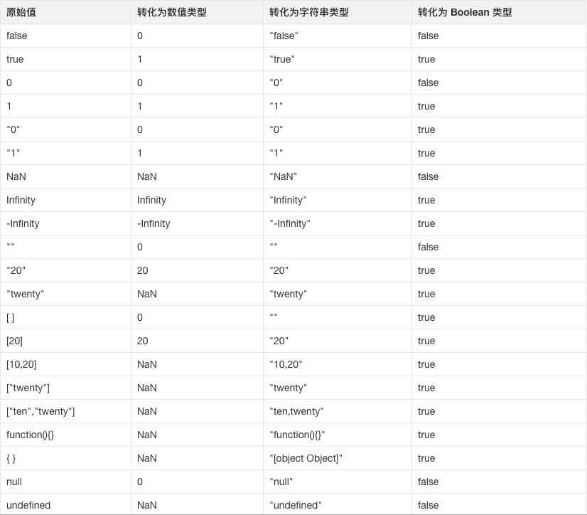

# 数据类型及类型转换

## 数据类型

Javascript 数据类型分为原始（Primitive）类型和对象（Object）类型

原始类型：

+ `null`

+ `undefined`

+ `boolean`

+ `string`

+ `number`

+ `symbol`

对象类型：

+ `Object`

+ `Array`

+ `Function`

+ `Date`

+ `Math`

+ `RexExp`

原始类型存储的都是值，对象类型存储的是地址（指针）

```js
function test(person) {
  person.age = 20
  person = {
    name: 'Tom',
    age: 10
  }
  return person
}
const p1 = {
  name: 'Bob',
  age: 30
}
const p2 = test(p1)
console.log(p1) // { name: 'Bob', age: 20 }
console.log(p2) // { name: 'Tom', age: 10 }
// 在函数传参的时候传递的是对象在堆中的内存地址值
// test 函数中的实参 person 是 p1 对象的内存地址, 通过调用 person.age = 20 改变了 p1 的值
// 随后 person 变成了另一块内存空间的地址，并且在最后将这另外一份内存空间的地址返回，赋给了 p2
```

## 类型判断

`typeof` 对于原始类型，除了 `null` 都可以显示正确的类型

`typeof` 对于对象类型，除了函数都会显示 `object`

```js
// 原始类型
typeof 1           // 'number'
typeof '1'         // 'string'
typeof undefined   // 'undefined'
typeof true        // 'boolean'
typeof Symbol()    // 'symbol'
typeof null        // 'object' 判断错误

// 对象类型
typeof []           // 'object'
typeof {}           // 'object'
typeof new Date()   // 'object'
typeof console.log  // 'function'
```

采用 `typeof` 判断对象数据类型是不合适的，采用 `instanceof` 会更好

`instanceof` 的原理是基于原型链的查询，只要处于原型链中，判断永远为 `true`

```js
const Person = function() {}
const p1 = new Person()
p1 instanceof Person // true

var str1 = 'hello world'
str1 instanceof String // false

var str2 = new String('hello world')
str2 instanceof String // true
```

## 类型转化

在 JS 中类型转换只有三种情况，分别是：

+ 转换为布尔值

+ 转换为数字

+ 转换为字符串

在 `if` 语句、逻辑语句、数学运算逻辑、`==` 等情况下都可能出现隐士类型转换



对象转原始类型，会调用内置的[ToPrimitive]函数，对于该函数而言，其逻辑如下：

1. 如果有 `Symbol.toPrimitive()` 方法，优先调用再返回

2. 调用 `valueOf()`，如果转换为原始类型，则返回

3. 调用 `toString()`，如果转换为原始类型，则返回

4. 如果都没有返回原始类型，会报错

## 面试题

1. `null` 是对象吗？

    `null` 不是对象，虽然 `typeof null` 会输出 `object`，在 JS 的最初版本中使用的是 32 位系统，`000` 开头代表是对象，而`null` 表示为全零，所以将它错误的判断为 `object`

2. `'1'.toString()` 为什么可以调用？

    原始类型存储的都是值，没有函数可以调用，例如 `undefined.toString()` 会报错。`'1'.toString()` 可以调用是因为 `'1'` 已经不是原始类型了，而是被强制转换成了基本包装类型 `String` 也就是对象类型，所以可以调用 `toString()` 方法

3. `0.1 + 0.2` 为什么不等于 `0.3`？

    `0.1` 和 `0.2` 在转换成二进制后会无限循环，由于标准位数的限制后面多余的位数会被截掉，此时就已经出现了精度的损失，相加后因浮点数小数位的限制而截断的二进制数字在转换为十进制就会变成 `0.30000000000000004`。

4. `Object.is()` 和 `===` 的区别

    `Object.is()` 在严格等于 `===` 的基础上修复了一些特殊情况下的失误，具体来说就是 `+0` 和 `-0`，`NaN` 和 `NaN`

    ```js
    NaN === NaN // false
    Object.is(NaN, NaN)  // true

    -0 === +0 // true
    Object.is(-0, +0) // false
    ```

5. `[] == ![]` 结果是什么？

    `==` 中，左右两边都需要转换为数字然后进行比较。

    `[]` 转换为数字为0。

    `![]` 首先是转换为布尔值，由于 `[]` 作为一个引用类型转换为布尔值为 `true`, 因此 `![]` 为 `false`，进而在转换成数字，变为 `0`。

    `0 == 0` ， 结果为 `true`

6. `==` 和 `===` 有什么区别？

    `===` 叫做严格相等，左右两边不仅值要相等，类型也要相等

    `==` 不像 `===` 那样严格，对于一般情况，只要值相等，就返回 `true`，但 `==` 还涉及一些类型转换，规则如下：

    + 两边的类型是否相同，相同的话就比较值的大小，例如 `1 == 2`，返回 `false`
    + 两边是否是 `null` 和 `undefined`，是的话就返回 `true`，例如 `null == undefined`，返回 `true`
    + 判断的类型是否是 `String` 和 `Number`，如果是，把 `String` 类型转换成 `Number`，再进行比较
    + 判断其中一方是否是 `Boolean`，是的话就把 `Boolean` 转换成 `Number`，再进行比较
    + 如果其中一方为 `Object`，且另一方为 `String`、`Number` 或者 `Symbol`，会将 `Object` 转换成字符串，再进行比较

7. 什么是 `BigInt`?

    `BigInt` 是一种新的数据类型，用于当整数值大于 `Number` 数据类型支持的范围时

    在JS中，所有的数字都以双精度 64 位浮点格式表示，这导致 JS 中的 `Number` 无法精确表示非常大的整数，它会将非常大的整数四舍五入，同时也会有一定的安全性问题。例如：

    `9007199254740992 === 9007199254740993 // true`