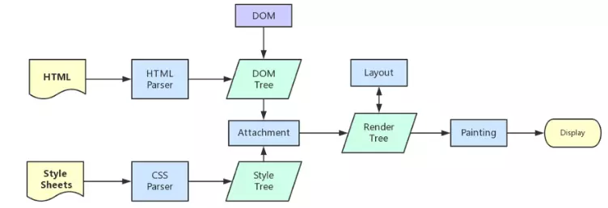
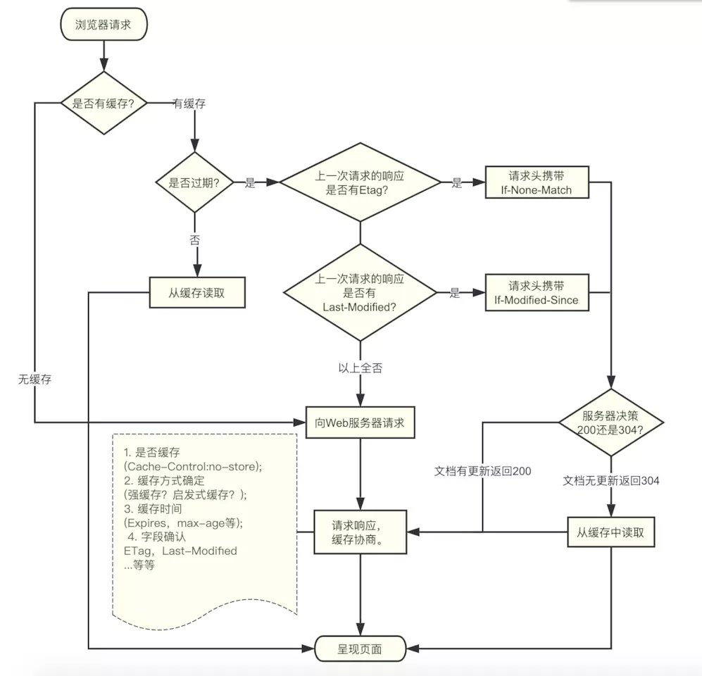

# 浏览器相关面试题

## 从输入 URL 到页面展现的过程

1. 浏览器查找当前 URL 是否存在缓存，并比较缓存是否过期

2. DNS 解析 URL 对应的 IP

3. 根据 IP 建立 TCP 连接（三次握手）

4. HTTP 发送请求，设置请求报文（请求头、请求体）

5. 服务器处理请求，返回请求的文件，浏览器接收 HTTP 响应

6. 浏览器解析渲染页面

    + 解析 HTML 生成 DOM 树

    + 解析 CSS 生成 css 规则树

    + 结合 DOM 树 与 css 规则树，生成渲染树 render 树

    + 布局 render 树（Layout/reflow），负责各元素尺寸/位置的计算

    + 绘制 render 树（print），绘制页面像素信息

    + 浏览器会将各层的信息发送给 GPU，GPU 会将各层合成（composite），显示在屏幕上

7. 关闭 TCP 连接（四次挥手）

## 浏览器解析渲染页面过程

1. 根据 HTML 解析 DOM 树

    + 根据 HTML 的内容，将标签按照结构解析成为 DOM 树，DOM 树解析的过程是一个深度优先遍历。即先构建当前节点的所有子节点，再构建下一个兄弟节点
    + 在读取 HTML 文档，构建 DOM 树的过程中，若遇到 script 标签，则 DOM 树的构建会暂停，直至脚本执行完毕

2. 根据 CSS 解析生成 CSS 规则树

    + 解析 CSS 规则树时 js 执行将暂停，直至 CSS 规则树就绪
    + 浏览器在 CSS 规则树生成之前不会进行渲染
    + 越是具体的 CSS 选择器，执行速度越慢

3. 结合 DOM 树和 CSS 规则树，生成渲染树

    + DOM 树和 CSS 规则树全部准备好了以后，浏览器才会开始构建渲染树
    + 精简 CSS 并可以加快 CSS 规则树的构建，从而加快页面相应速度

4. 根据渲染树计算每一个节点的信息（布局）

    + 布局：通过渲染树中渲染对象的信息，计算出每一个渲染对象的位置和尺寸
    + 回流：在布局完成后，发现了某个部分发生了变化影响了布局，那就需要倒回去重新渲染

5. 据计算好的信息绘制页面

    + 绘制阶段，系统会遍历呈现树，并调用呈现器的 “paint” 方法，将呈现器的内容显示在屏幕上
    + 回流：某个元素的尺寸发生了变化，则需重新计算渲染树，重新渲染
    + 重绘：某个元素的背景颜色，文字颜色等，不影响元素周围或内部布局的属性，将只会引起浏览器的重绘



## 重绘和回流

重绘和回流是渲染步骤中的一小节，但是这两个步骤对于性能影响很大。

+ 重绘：当节点需要更改外观而不会影响布局的，比如改变 color、background-color、visibility等就叫称为重绘
+ 回流：布局或者几何属性需要改变 就称为回流

注意:

+ 回流必定会发生重绘，重绘不一定会引发回流
+ 回流所需的成本比重绘高的多，改变深层次的节点很可能导致父节点的一系列回流

会导致回流的操作：

+ 页面首次渲染
+ 浏览器窗口大小发生改变
+ 元素尺寸或位置发生改变
+ 元素内容变化（文字数量或图片大小等等）
+ 元素字体大小变化
+ 添加或者删除可见的 DOM 元素
+ 激活CSS伪类（例如：:hover）
+ 查询某些属性或调用某些方法

减少重绘和回流：

+ 使用 translate 替代 top
+ 使用 visibility 替换 display: none ，因为前者只会引起重绘，后者会引发回流（改变了布局）
+ 把 DOM 离线后修改，比如：先把 DOM 给 display:none (有一次 Reflow)，然后你修改 100 次，然后再把它显示出来
+ 不要把 DOM 结点的属性值放在一个循环里当成循环里的变量
+ 不要使用 table 布局，可能很小的一个小改动会造成整个 table 的重新布局
+ 动画实现的速度的选择，动画速度越快，回流次数越多，也可以选择使用 requestAnimationFrame
+ CSS 选择符从右往左匹配查找，避免 DOM 深度过深
+ 将频繁运行的动画变为图层，图层能够阻止该节点回流影响别的元素。比如对于 video 标签，浏览器会自动将该节点变为图层

  CSS:

  + 避免使用 table 布局
  + 尽可能在 DOM 树的最末端改变 class
  + 避免设置多层内联样式。
  + 将动画效果应用到 position 属性为 absolute 或 fixed 的元素上。
  + 避免使用 CSS 表达式例如：calc()

  JavaScript:

  + 避免频繁操作样式，最好一次性重写style属性，或者将样式列表定义为 class 并一次性更改class属性
  + 避免频繁操作 DOM，创建一个 documentFragment，在它上面应用所有 DOM 操作，最后再把它添加到文档中
  + 也可以先为元素设置 display: none，操作结束后再把它显示出来。因为在display属性为 none 的元素上进行的 DOM 操作不会引发回流和重绘
  + 避免频繁读取会引发回流/重绘的属性，如果确实需要多次使用，就用一个变量缓存起来
  + 对具有复杂动画的元素使用绝对定位，使它脱离文档流，否则会引起父元素及后续元素频繁回流

## 浏览器缓存

浏览器缓存策略是根据第一次请求资源时返回的响应头来确认，分为强缓存和协商缓存。



### 强缓存

强缓存通过 `Expires` 和 `Cache-Control` 响应头实现，在缓存期间不需要请求，状态码为 200。超过这个时间后缓存过期，浏览器需要重新请求。

`Expires`: 设置缓存失效的绝对时间，浏览器通过将其与当前本地时间对比，判断资源是否过期。

`Cache-Control`：设置可缓存性，值 `max-age=xx` 表示缓存失效的相对时间，如：`max-age=300`，表示资源会在 300 秒后过期，需要再次请求，优先级比 `Expires` 高。

`Cache-Control` 其他值：`no-store` 不进行任何缓存；`no-cache` 不直接使用缓存，需要向服务器发起请求；

### 协商缓存

如果强缓存过期了，可以使用协商缓存。

协商缓存主要应用于一些时常需要动态更新的资源文件，解决了无法及时获取更新资源的问题。

#### Last-Modified 和 If-Modified-Since

`Last-Modified`：表示资源最后一次被修改的时间。

`If-Modified-Since`：服务器会将 `If-Modified-Since` 的值与 `Last-Modified` 的值进行对比，如果相等，表示未修改，响应 304；如果不相等，表示修改了，响应 200，返回资源。

#### ETag 和 If-None-Match

`ETag` 存储的是文件的特殊标识，类似文件的指纹，服务器第一次响应是返回 `ETag` 。

浏览器后续请求时将当前 `ETag` 作为`If-None-Match` 发送给服务器，询问该资源 `ETag` 是否变动，无变动就响应 304，有变动就将新的资源发送回来。

`ETag` 优先级比 `Last-Modified` 高。

### 选择合适的缓存策略

对于大部分的场景都可以使用强缓存配合协商缓存解决，但是在一些特殊的地方可能需要选择特殊的缓存策略

对于某些不需要缓存的资源，可以使用 `Cache-control: no-store` ，表示该资源不需要缓存。

对于频繁变动的资源，可以使用 `Cache-Control: no-cache` 并配合 `ETag` 使用，表示该资源已被缓存，但是每次都会发送请求询问资源是否更新。

对于代码文件来说，通常使用 `Cache-Control: max-age=31536000` 并配合协商缓存使用，然后对文件进行指纹处理，一旦文件名变动就会立刻下载新的文件。

## 本地存储

### Cookie

`Cookie` 是服务器保存在浏览器的一小段文本信息，每个 Cookie 的大小一般不能超过 4KB。

可以通过 `Cookie` 来向访问者电脑上存储数据，或者某些网站为了辨别用户身份、进行 session 跟踪而储存在用户本地终端上的数据。

存储在 `Cookie` 中的数据，每次都会被浏览器自动放在 http 请求中，如果这些数据并不是每个请求都需要发给服务端的数据，浏览器这设置自动处理无疑增加了网络开销。

如果这些数据是每个请求都需要发给服务端的数据（比如身份认证信息），浏览器这设置自动处理就大大免去了重复添加操作。所以对于那种“每次请求都要携带的信息（最典型的就是身份认证信息）”就特别适合放在 `Cookie` 中。

特征：

+ `Cookie` 的存储是以域名形式进行区分的，不同的域下存储的 `Cookie` 是独立的
+ 我们能够操作的 `Cookie` 是当前域以及当前域下的所有子域
+ 一个域名下存放的 `Cookie` 的个数是有限制的，不同的浏览器存放的个数不一样,一般为20个，大小一般为 4KB
+ `Cookie` 也可以设置过期的时间，默认是会话结束的时候，当时间到期自动销毁

`Cookie` 主要用于以下三个方面：

+ 会话状态管理（如用户登录状态、购物车、游戏分数或其它需要记录的信息）
+ 个性化设置（如用户自定义设置、主题等）
+ 浏览器行为跟踪（如跟踪分析用户行为等）

客户端设置：

```js
document.cookie = '名字=值';
// 在设置属性时，属性之间由一个分号和一个空格隔开。
document.cookie = 'username=leo; domain=baike.baidu.com'  //并且设置了生效域

// 当我们需要设置多个cookie时
document.cookie = "name=Jonh";
document.cookie = "age=12";
```

客户端可以设置 `Cookie` 下列选项：

+ expires 过期时间
+ domain 服务器域名
+ path 域名下的哪些路径可以接受 Cookie
+ secure 有条件：只有在 https 协议的网页中，客户端设置 secure 类型的 cookie 才能成功），但无法设置 HttpOnly 选项

### LocalStorage

HTML5 新的 API

特点：

+ 生命周期：持久化的本地存储，除非主动删除数据，否则数据是永远不会过期
+ 存储的信息在同一域中是共享的
+ 当本页操作（新增、修改、删除）了localStorage 的时候，本页面不会触发 storage 事件,但是别的页面会触发 storage 事件
+ 大小跟浏览器有关，一般是5M
+ localStorage 受同源策略的限制

Storage 方法：

```js
// 设置
localStorage.setItem('username','leo')
// 读取
localStorage.getItem('username')
// 删除
localStorage.removeItem('username')
// 全部清除
localStorage.clear()
```

当 storage 发生改变的时候触发， storage 事件

### SessionStorage

跟 LocalStorage 差不多，也是本地存储，会话本地存储

特点：

用于本地存储一个会话（session）中的数据，这些数据只有在同一个会话中的页面才能访问并且当会话结束后数据也随之销毁。

SessionStorage 不是一种持久化的本地存储，仅仅是会话级别的存储，关闭窗口后，SessionStorage 即被销毁

新窗口打开同源的另一个页面 SsessionStorage 也是没有的

## 浏览器安全

### CSRF（跨站请求伪造）

### XSS（跨域脚本攻击）

## 页面性能优化

提高页面性能的方法：

+ 资源压缩合并，减少 HTTP 请求，开启 Gzip 压缩

+ 非核心代码异步加载

  + 异步加载方式
    + 动态脚本加载（用 Js 创建 script 标签）
    + defer：在 HTML 解析完之后才会执行，如果是多个，按照加载的顺序依次执行
    + async：在加载完成之后立即执行，如果是多个，执行顺序和加载顺序无关

+ 利用浏览器缓存

  + 缓存分类

    + 强缓存
      + Expries
      + Cache-Control
    + 协商缓存
      + Last-Modified If-Modified-Since
      + Etag If-None-Match

  + 缓存原理

+ 使用 CDN

+ 预解析 DNS
