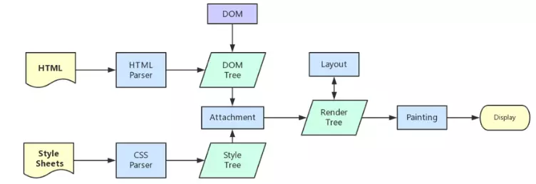
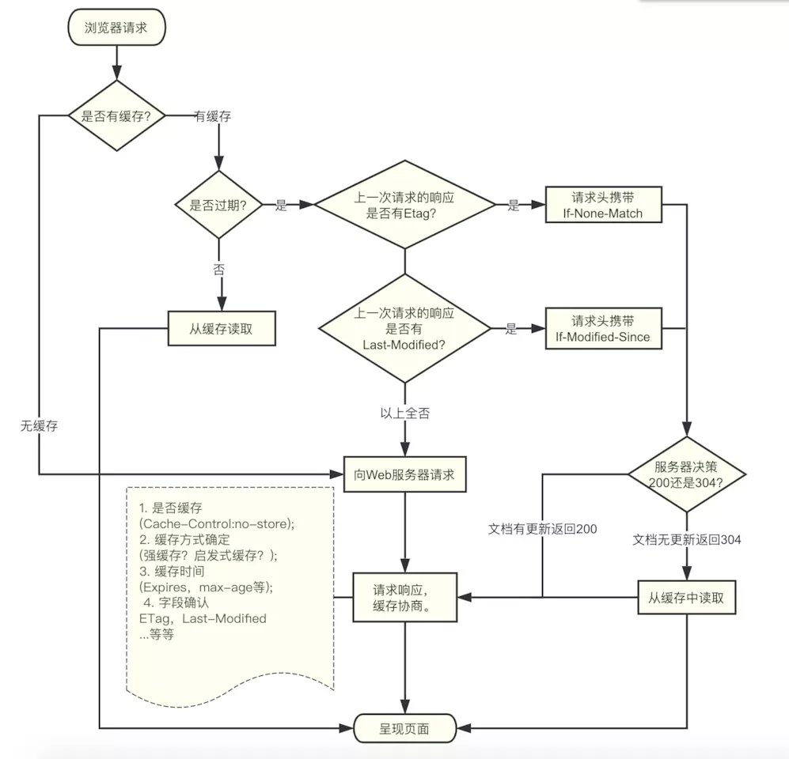

# 浏览器相关面试题

## 从输入 URL 到展示页面的过程

1. 浏览器查找当前 URL 是否存在缓存，并比较缓存是否过期

2. DNS 解析 URL 对应的 IP

3. 根据 IP 建立 TCP 连接（三次握手）

4. HTTP 发送请求，设置请求报文（请求头、请求体）

5. 服务器处理请求，返回请求的文件，浏览器接收 HTTP 响应

6. 浏览器解析渲染页面

    + 解析 HTML 生成 DOM 树

    + 解析 CSS 生成 css 规则树

    + 结合 DOM 树 与 css 规则树，生成渲染树 render 树

    + 布局 render 树（Layout/reflow），负责各元素尺寸/位置的计算

    + 绘制 render 树（print），绘制页面像素信息

    + 浏览器会将各层的信息发送给 GPU，GPU 会将各层合成（composite），显示在屏幕上

7. 关闭 TCP 连接（四次挥手）

## 浏览器渲染解析页面

1. 根据 HTML 解析 DOM 树

    + 根据 HTML 的内容，将标签按照结构解析成为 DOM 树，DOM 树解析的过程是一个深度优先遍历。即先构建当前节点的所有子节点，再构建下一个兄弟节点
    + 在读取 HTML 文档，构建 DOM 树的过程中，若遇到 script 标签，则 DOM 树的构建会暂停，直至脚本执行完毕

2. 根据 CSS 解析生成 CSS 规则树

    + 解析 CSS 规则树时 js 执行将暂停，直至 CSS 规则树就绪
    + 浏览器在 CSS 规则树生成之前不会进行渲染
    + 越是具体的 CSS 选择器，执行速度越慢

3. 结合 DOM 树和 CSS 规则树，生成渲染树

    + DOM 树和 CSS 规则树全部准备好了以后，浏览器才会开始构建渲染树
    + 精简 CSS 并可以加快 CSS 规则树的构建，从而加快页面相应速度

4. 根据渲染树计算每一个节点的信息（布局）

    + 布局：通过渲染树中渲染对象的信息，计算出每一个渲染对象的位置和尺寸
    + 回流：在布局完成后，发现了某个部分发生了变化影响了布局，那就需要倒回去重新渲染

5. 据计算好的信息绘制页面

    + 绘制阶段，系统会遍历呈现树，并调用呈现器的 “paint” 方法，将呈现器的内容显示在屏幕上
    + 重绘：某个元素的背景颜色，文字颜色等，不影响元素周围或内部布局的属性，将只会引起浏览器的重绘
    + 回流：某个元素的尺寸发生了变化，则需重新计算渲染树，重新渲染



## 重绘（Repaint）和回流（Reflow）

重绘和回流是渲染步骤中的一小节，但是这两个步骤对于性能影响很大。

+ 重绘：当节点需要更改外观而不会影响布局的，比如改变 color、background-color、visibility等就叫称为重绘
+ 回流：布局或者几何属性需要改变 就称为回流

注意:

+ 回流必定会发生重绘，重绘不一定会引发回流
+ 回流所需的成本比重绘高的多，改变深层次的节点很可能导致父节点的一系列回流

会导致回流的操作：

+ 页面首次渲染
+ 浏览器窗口大小发生改变
+ 元素尺寸或位置发生改变
+ 元素内容变化（文字数量或图片大小等等）
+ 元素字体大小变化
+ 添加或者删除可见的 DOM 元素
+ 激活CSS伪类（例如：:hover）
+ 查询某些属性或调用某些方法

减少重绘和回流：

+ 使用 translate 替代 top
+ 使用 visibility 替换 display: none ，因为前者只会引起重绘，后者会引发回流（改变了布局）
+ 把 DOM 离线后修改，比如：先把 DOM 给 display:none (有一次 Reflow)，然后你修改 100 次，然后再把它显示出来
+ 不要把 DOM 结点的属性值放在一个循环里当成循环里的变量
+ 不要使用 table 布局，可能很小的一个小改动会造成整个 table 的重新布局
+ 动画实现的速度的选择，动画速度越快，回流次数越多，也可以选择使用 requestAnimationFrame
+ CSS 选择符从右往左匹配查找，避免 DOM 深度过深
+ 将频繁运行的动画变为图层，图层能够阻止该节点回流影响别的元素。比如对于 video 标签，浏览器会自动将该节点变为图层

  CSS:

  + 避免使用 table 布局
  + 尽可能在 DOM 树的最末端改变 class
  + 避免设置多层内联样式。
  + 将动画效果应用到 position 属性为 absolute 或 fixed 的元素上。
  + 避免使用 CSS 表达式例如：calc()

  JavaScript:

  + 避免频繁操作样式，最好一次性重写style属性，或者将样式列表定义为 class 并一次性更改class属性
  + 避免频繁操作 DOM，创建一个 documentFragment，在它上面应用所有 DOM 操作，最后再把它添加到文档中
  + 也可以先为元素设置 display: none，操作结束后再把它显示出来。因为在display属性为 none 的元素上进行的 DOM 操作不会引发回流和重绘
  + 避免频繁读取会引发回流/重绘的属性，如果确实需要多次使用，就用一个变量缓存起来
  + 对具有复杂动画的元素使用绝对定位，使它脱离文档流，否则会引起父元素及后续元素频繁回流

## 跨域及常见解决办法

浏览器出于安全考虑有同源策略，同源策略是指 `协议 + 域名 + 端口` 三者相同，即便两个不同的域名指向同一个 ip 地址也非同源

同源策略限制以下几种行为：

+ `Cookie`、`LocalStorage` 和 `IndexDB` 无法读取
+ `DOM` 和 `Js` 对象无法获得
+ `AJAX` 请求不能发送

常用跨越解决办法：

+ 通过 jsonp
+ 跨域资源共享（CORS）
+ nginx 代理
+ nodejs 中间件代理

### jsonp

jsonp 的原理很简单，就是利用 `<script>` 标签没有跨域限制的漏洞。通过 `<script>` 标签指向一个需要访问的地址并提供一个回调函数来接收数据

jsonp 使用简单且兼容性不错，但只限于 `get` 请求

```js
function jsonp(url, jsonpCallback, success) {
  let script = document.createElement('script')
  script.src = url
  script.async = true
  script.type = 'text/javascript'
  window[jsonpCallback] = function(data) {
    success && success(data)
  }
  document.body.appendChild(script)
}
jsonp('http://xxx', 'callback', function(value) {
  console.log(value)
})
```

### CORS

跨域资源共享CORS，定义了必须在访问跨域资源时，浏览器与服务器应该如何沟通

基本思想就是使用自定义的 HTTP 头部让浏览器与服务器进行沟通，从而决定请求或响应是应该成功还是失败。

普通跨域请求：服务端只需设置 `Access-Control-Allow-Origin` 即可，该属性表示哪些域名可以访问资源，如果设置 `通配符 *` 则表示所有网站都可以访问资源

服务端设置：

```java
// 允许跨域访问的域名：若有端口需写全（协议+域名+端口），若没有端口末尾不用加'/'
response.setHeader("Access-Control-Allow-Origin", "http://www.domain1.com");

// 允许前端带认证cookie：启用此项后，上面的域名不能为'*'，必须指定具体的域名，否则浏览器会提示
response.setHeader("Access-Control-Allow-Credentials", "true");

// 提示 OPTIONS预检时，后端需要设置的两个常用自定义头
response.setHeader("Access-Control-Allow-Headers", "Content-Type,X-Requested-With");
```

若要带 cookie 请求：前后端都需要设置:

```js
// 1. 原生 js
var xhr = new XMLHttpRequest();
// 设置是否带cookie
xhr.withCredentials = true;
xhr.open('post', 'http://www.domain2.com:8080/login', true);
xhr.setRequestHeader('Content-Type', 'application/x-www-form-urlencoded');
xhr.send('user=admin');

xhr.onreadystatechange = function() {
    if (xhr.readyState == 4 && xhr.status == 200) {
        alert(xhr.responseText);
    }
};

// 2. jQuery ajax
$.ajax({
    ...
   xhrFields: {
    withCredentials: true // 设置是否带cookie
   },
   crossDomain: true,   // 会让请求头中包含跨域的额外信息，但不会含cookie
    ...
});

// 3. axios
axios.defaults.withCredentials = true

```

### nginx 代理跨域

跨域原理： 同源策略是浏览器的安全策略，不是 HTTP 协议的一部分。服务器端调用 HTTP 接口只是使用 HTTP 协议，不会执行 JS 脚本，不需要同源策略，也就不存在跨越问题

实现思路： 通过 nginx 配置一个代理服务器（域名与 domain1 相同，端口不同）做跳板机，反向代理访问 domain2 接口，并且可以顺便修改 cookie 中 domain 信息，方便当前域c ookie 写入，实现跨域登录

nginx 具体配置：

```shell
#proxy服务器
server {
    listen       81;
    server_name  www.domain1.com;

    location / {
        proxy_pass   http://www.domain2.com:8080;  #反向代理
        proxy_cookie_domain www.domain2.com www.domain1.com; #修改cookie里域名
        index  index.html index.htm;

        # 当用 webpack-dev-server等中间件代理接口访问nignx时，此时无浏览器参与，故没有同源限制，下面的跨域配置可不启用
        add_header Access-Control-Allow-Origin http://www.domain1.com;  #当前端只跨域不带cookie时，可为*
        add_header Access-Control-Allow-Credentials true;
    }
}
```

### Nodejs中间件代理跨域

Nodejs 中间件实现跨域代理，原理大致与 nginx 相同，都是通过启一个代理服务器，实现数据的转发，也可以通过设置 `cookieDomainRewrite` 参数修改响应头中 cookie 中域名，实现当前域的 cookie 写入，方便接口登录认证

利用 node + express + http-proxy-middleware 搭建一个 proxy 服务器

```js
var express = require('express');
var proxy = require('http-proxy-middleware');
var app = express();

app.use('/', proxy({
    // 代理跨域目标接口
    target: 'http://www.domain2.com:8080',
    changeOrigin: true,

    // 修改响应头信息，实现跨域并允许带cookie
    onProxyRes: function(proxyRes, req, res) {
        res.header('Access-Control-Allow-Origin', 'http://www.domain1.com');
        res.header('Access-Control-Allow-Credentials', 'true');
    },

    // 修改响应信息中的cookie域名
    cookieDomainRewrite: 'www.domain1.com'  // 可以为false，表示不修改
}));

app.listen(3000);
console.log('Proxy server is listen at port 3000...');
```

Vue 框架，利用 node + webpack + webpack-dev-server 代理接口跨域

在开发环境下，由于vue 渲染服务和接口代理服务都是 webpack-dev-server 同一个，所以页面与代理接口之间不再跨域，无须设置headers跨域信息了

webpack.config.js部分配置：

```js
module.exports = {
    entry: {},
    module: {},
    ...
    devServer: {
        historyApiFallback: true,
        proxy: [{
            context: '/login',
            target: 'http://www.domain2.com:8080',  // 代理跨域目标接口
            changeOrigin: true,
            secure: false,  // 当代理某些 https服务报错时用
            cookieDomainRewrite: 'www.domain1.com'  // 可以为 false，表示不修改
        }],
        noInfo: true
    }
}
```

## 本地存储

### Cookie

`Cookie` 是服务器保存在浏览器的一小段文本信息，每个 Cookie 的大小一般不能超过 4KB

可以通过 `Cookie` 来向访问者电脑上存储数据，或者某些网站为了辨别用户身份、进行 session 跟踪而储存在用户本地终端上的数据

存储在 `Cookie` 中的数据，每次都会被浏览器自动放在 http 请求中，如果这些数据并不是每个请求都需要发给服务端的数据，浏览器这设置自动处理无疑增加了网络开销

如果这些数据是每个请求都需要发给服务端的数据（比如身份认证信息），浏览器这设置自动处理就大大免去了重复添加操作。所以对于那种“每次请求都要携带的信息（最典型的就是身份认证信息）”就特别适合放在 `Cookie` 中

特征：

+ `Cookie` 的存储是以域名形式进行区分的，不同的域下存储的 `Cookie` 是独立的
+ 我们能够操作的 `Cookie` 是当前域以及当前域下的所有子域
+ 一个域名下存放的 `Cookie` 的个数是有限制的，不同的浏览器存放的个数不一样,一般为20个，大小一般为 4KB
+ `Cookie` 也可以设置过期的时间，默认是会话结束的时候，当时间到期自动销毁

`Cookie` 主要用于以下三个方面：

+ 会话状态管理（如用户登录状态、购物车、游戏分数或其它需要记录的信息）
+ 个性化设置（如用户自定义设置、主题等）
+ 浏览器行为跟踪（如跟踪分析用户行为等）

客户端设置：

```js
document.cookie = '名字=值';
//在设置属性时，属性之间由一个分号和一个空格隔开。
document.cookie = 'username=leo; domain=baike.baidu.com'  //并且设置了生效域

//当我们需要设置多个cookie时
document.cookie = "name=Jonh";
document.cookie = "age=12";
document.cookie = "class=111";
```

客户端可以设置 `Cookie` 下列选项：

+ expires 过期时间
+ domain 服务器域名
+ path 域名下的哪些路径可以接受 Cookie
+ secure 有条件：只有在 https 协议的网页中，客户端设置 secure 类型的 cookie 才能成功），但无法设置 HttpOnly 选项

### LocalStorage 本地存储

HTML5 新的 API

特点：

+ 生命周期：持久化的本地存储，除非主动删除数据，否则数据是永远不会过期
+ 存储的信息在同一域中是共享的
+ 当本页操作（新增、修改、删除）了localStorage 的时候，本页面不会触发 storage 事件,但是别的页面会触发 storage 事件
+ 大小跟浏览器有关，一般是5M
+ localStorage 受同源策略的限制

Storage 方法：

```js
// 设置
localStorage.setItem('username','leo')
// 读取
localStorage.getItem('username')
// 删除
localStorage.removeItem('username')
// 全部清除
localStorage.clear()
```

当 storage 发生改变的时候触发， storage 事件

### SessionStorage 会话本地存储

跟 LocalStorage 差不多，也是本地存储，会话本地存储

特点：

用于本地存储一个会话（session）中的数据，这些数据只有在同一个会话中的页面才能访问并且当会话结束后数据也随之销毁。

SessionStorage 不是一种持久化的本地存储，仅仅是会话级别的存储，关闭窗口后，SessionStorage 即被销毁

新窗口打开同源的另一个页面 SsessionStorage 也是没有的

## 浏览器缓存

浏览器对于缓存的处理是根据第一次请求资源时返回的响应头来确认的

根据响应头，浏览器缓存策略一般分为：强缓存、协商缓存

浏览器常见字段和指令

+ `Expires`: 告知客户端资源缓存失效的绝对时间
+ `Last-Modified`: 资源最后一次修改的时间
+ `Etag`: 文件的特殊标识
+ `Cache-Control`:告诉客户端或是服务器如何处理缓存

  + `Cache-Control: private`：表示客户端可以缓存
  + `Cache-Control: public` ：表示客户端和代理服务器都可缓存，如果没有明确指定 private，则默认为 public
  + `Cache-Control: no-cache`: 表示需要可以缓存，但每次用应该去向服务器验证缓存是否可用
  + `Cache-Control: no-store`: 表示所有内容都不会缓存，强制缓存，对比缓存都不会触发.
  + `Cache-Control: max-age=xxx`: 表示缓存的内容将在 xxx 秒后失效

自从 HTTP 1.1开始，Expires 逐渐被 Cache-Control 取代。Cache-Control 是一个相对时间，即使客户端时间发生改变，相对时间也不会随之改变，这样可以保持服务器和客户端的时间一致性



### 强缓存

强缓存简单理解就是给浏览器缓存设置过期时间，超过这个时间之后缓存就是过期，浏览器需要重新请求

强缓存主要是通过 HTTP 请求头中的 Expires 和 Cache-Control 两个字段控制

Expires 是一个HTTP/1.0的字段，它给浏览器设置了一个绝对时间，当浏览器时间超过这个绝对时间之后，重新向服务器发送请求

+ 它描述的是一个绝对时间，用 GMT 格式的字符串表示

  `Expires: Wed Feb 20 2019 11:25:41 GMT`

+ 也可以在 HTML 文件里直接使用

  `<meta http-equiv="expires" content="Wed Feb 20 2019 11:25:41 GMT">`

+ 弊端：Expires 返回的是服务器的时间，但判断的时候用的却是客户端的时间，因为用户有可能改变客户端的时间，导致缓存时间判断出错，这也是引入Cache-Control:max-age 指令的原因之一

为了解决 Expires 存在的问题，HTTP/1.1 版本中提出了 Cache-Control:max-age

该字段与 Expires 的缓存思路相同，都是设置了一个过期时间，不同的是 max-age 设置的是相对缓存时间开始往后的多少秒，因此不再受日期不准确情况的影响

在优先级上 max-age > Expires，当两者同时出现在响应头时, Expires 将被 max-age覆盖

  `Cache-control: max-age=666` 表示资源会在 666 秒后过期，需要再次请求

### 协商缓存

协商缓存的过程是，先从缓存中获取对应的数据标识，然后向服务器发送请求，确认数据是否更新，如果更新，则返回新数据和新缓存；反之，则返回304状态码，告知客户端缓存未更新，可继续使用

协商缓存主要应用于一些时常需要动态更新的资源文件，解决了无法及时获取更新资源的问题

协商缓存在协议里的字段是 Last-Modified 和 If-Modified-Since

+ `Last-Modified`：服务器告知客户端，资源最后一次被修改的时间

    `Last-Modified: Wed Feb 20 2019 14:08:32 GMT`

+ `If-Modified-Since`：再次请求时，请求头中带有该字段，服务器会将 `If-Modified-Since` 的值与 `Last-Modified` 字段进行对比，如果相等，则表示未修改，响应304 Not Modified；反之，则表示修改了，响应200状态码，返回数据

缺点：

+ `Last-Modified`，`If-Modified-Since` 都是以秒为单位进行更新，如果小于该单位高频进行更新的话，则不适合采用该方法

+ 如果文件是通过服务器动态生成的，那么该方法的更新时间永远是生成的时间，尽管文件可能没有变化，所以起不到缓存的作用

另外一对 header 来管理协商缓存，ETag、If-None-Match

`Etag` 存储的是文件的特殊标识(一般都是 hash 生成的)，服务器存储着文件的 `Etag` 字段，可以在与每次客户端传送`If-no-match` 的字段进行比较，如果相等，则表示未修改，响应304；反之，则表示已修改，响应200状态码，返回数据

优先级：

`ETag` 与 `If-None-Match` > `Last-Modified` 与 `If-Modified-Since`, 同时存在时, 前者覆盖后者

## 前段鉴权

常用的鉴权有4种：

1. HTTP 基本认证
2. session-cookie
3. Token 验证（包括 JWT、SSO）
4. OAuth 开放授权
